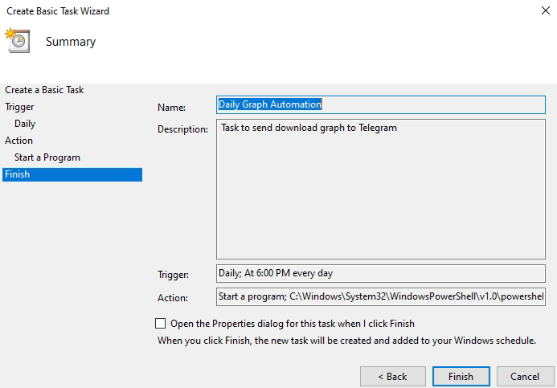
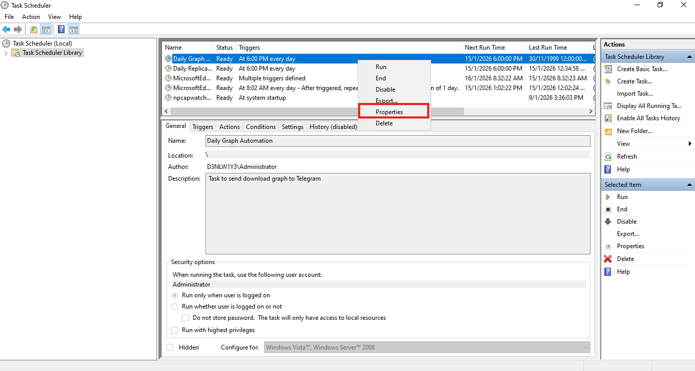
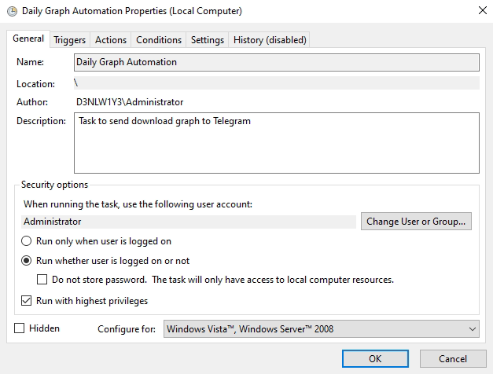
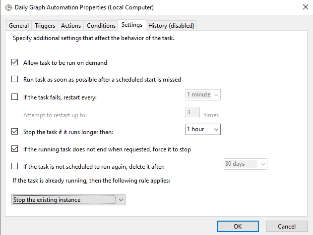
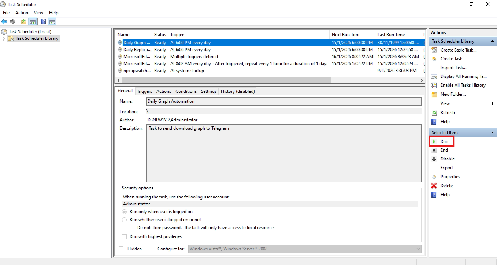

# Windows Task Scheduler Configuration

This document explains the correct configuration required for running
GraphAutomation.ps1 reliably.

## General Tab

- Run whether user is logged on or not ✅
- Run with highest privileges ✅
- Do NOT check "Do not store password" ❌

Why?
Windows runs tasks without stored passwords using a restricted token,
which breaks:
- PowerShell execution
- Network access
- API calls

## How to setup Task scheduler

1. On windows search bar, type "Task Scheduler".

2. To create basic task, right click on the **Task Scheduler Library** and click **Create Basic Task...**.

<p align="center">
  <br>
</p>

3. Name the task and type a description and click next.

<p align="center">
  <br>
</p>

4. Set the Trigger to **Daily** in this case and click next.

<p align="center">
  <br>
</p>

5. Set the start time to tell the scheduler when to start this task. Check the box for **Synchronize across time zones**. Click next.

<p align="center">
  <br>
</p>

6. Set **Start a program** on **Action** tab. Click next.

<p align="center">
  <br>
</p>

7. On **Start a Program** tab, fill below and click next.

Program/script:
```bash
C:\Windows\System32\WindowsPowerShell\v1.0\powershell.exe
```

Add arguments:
```bash
-ExecutionPolicy Bypass -NonInteractive -File "C:\Program Files (x86)\PRTG Network Monitor\notifications\exe\GraphAutomation.ps1"
```

Start in:
```bash
C:\Program Files (x86)\PRTG Network Monitor\notifications\exe
```

<p align="center">
  <br>
</p>

8. Review the settings and click **Finish**.

<p align="center">
  <br>
</p>

9. Then select the create task, right click and select **Properties**.

<p align="center">
  <br>
</p>

10. On **General** tab, make sure to:
- Check box for **Run whether user is logged on or not**
- Check box for **Run with highest privileges**
- Uncheck box for **Do not store password. The task will only have access to local computer resources.**

<p align="center">
  <br>
</p>

11. On **Triggers** tab, make sure the **Status** is **Enabled**.

<p align="center">
  <br>
</p>

12. On **Settings** tab and click ok.
- Check box for **Allow task to be run on demand**
- Check box for **Stop the task if it runs longer than: select 1 hour**
- Check box for **If the running task does not end when requested, force it to stop**
- Select **Stop the existing instance** under **If the task is not scheduled to run again, delete it after**

<p align="center">
  <br>
</p>

13. To run the task manually, select the create task and click **Run** on the right side of the tab

<p align="center">
  <br>
</p>

Expected results:
- Exit code: 0x0
- Telegram message received

---


